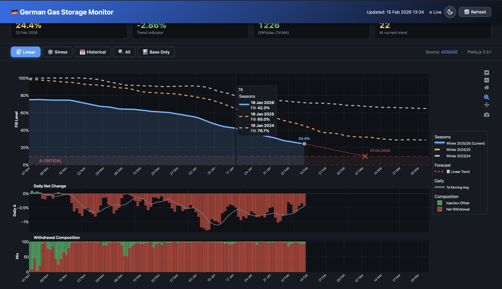

# Gasometer Dashboard 🇩🇪

> Ein leichtgewichtiges Go-Programm zur Visualisierung der aktuellen Gasreserven in Deutschland.



## 📖 Über das Projekt

Dieses Dashboard bietet einen schnellen, visuellen Überblick über den aktuellen Füllstand der deutschen Gasspeicher. Angesichts schwankender Reserven und gestiegenen Bedarfs (u.a. durch Gas-Verstromung) ist ein transparentes Monitoring der Versorgungslage essenziell.

Das Tool aggregiert Daten, visualisiert kritische Schwellenwerte (z. B. die 10%-Marke) und hilft dabei, Trends im Vergleich zu Vorjahreswerten zu erkennen.

### ✨ Features
* **Live-Daten:** Tägliche Aktualisierung der Speicherstände.
* **Visuelles Dashboard:** Übersichtliche Darstellung der Füllstände und kritischen Zonen.
* **Leichtgewichtig:** Backend in Go, Frontend basierend auf einfachen HTML-Templates.
* **Cross-Platform:** Läuft nativ auf Windows, macOS und Linux.

## 📊 Datenquelle

Die Daten werden von **Aggregated Gas Storage Inventory (AGSI+)** bereitgestellt.
Vielen Dank an [GIE (Gas Infrastructure Europe)](https://agsi.gie.eu) für die Bereitstellung der API und die Aggregation der Daten.

## 🛠 Technische Details

Das Projekt ist in **Go (Golang)** geschrieben, um eine hohe Performance und einfache Verteilung (Single Binary) zu gewährleisten.

* **Backend:** Go (Standard Library)
* **Frontend:** HTML / CSS (Go `html/template`)
* **Entwicklung:** Das Projekt wurde ursprünglich mit KI-Unterstützung (Claude) erstellt und manuell für den produktiven Einsatz optimiert und erweitert.

## Projektstruktur

```text
.
├── main.go                # Einstiegspunkt (Backend-Logik & Server)
├── templates/
│   └── dashboard.html     # Frontend-Visualisierung
├── img/                   # Screenshots und Assets
└── README.md
```

## 🚀 Installation & Ausführung

### 1. Voraussetzungen
Stelle sicher, dass **[Go](https://go.dev/dl/)** auf deinem System installiert ist.

### 2. Projekt herunterladen
Klone das Repository oder lade es als ZIP herunter und entpacke es:

```bash
git clone [https://github.com/THX1188/gasometer-dashboard.git](https://github.com/THX1188/gasometer-dashboard.git)

```

### 3. Programm kompilieren und starten.
```bash
cd gasometer-dashboard
go run main.go
```

### 4. Browser mit Url http://localhost:8080 öffnen

fertig!

---
## ⚖️ Disclaimer

**Wichtiger Hinweis:**
Dieses Software-Projekt dient rein informativen Zwecken zur Visualisierung öffentlich zugänglicher Daten.

1.  **Keine Gewährleistung:** Es wird keine Garantie für die Richtigkeit, Vollständigkeit oder Aktualität der dargestellten Daten übernommen.
2.  **Keine Beratung:** Die dargestellten Informationen, insbesondere Hinweise auf kritische Füllstände, stellen keine offizielle Prognose oder Warnung im Sinne des Katastrophenschutzes dar.
3.  **Datenhoheit:** Die Rechte an den Rohdaten liegen beim jeweiligen Anbieter (GIE/AGSI).
4. **Aktualität der Daten:** Die Schnittstelle ist nicht tagesgenau weil Daten des Anbieters erst geprüft und zum Teil spät Abends nochmals nachaktualisiert werden. Üblicherweise handelt es sich um die Daten des Vortages, am Wochenende scheint die Belieferung zu ruhen.
5. **Offizielle Daten:** Jederzeit können Sie die offiziellen Daten unter [GIE (Gas Infrastructure Europe)](https://agsi.gie.eu) direkt einsehen. Dort wird für den Gas-Tag ein Überblick über die europäischen Länder gegeben. Über Drill-Down lassen sich dann Lieferstandorte der Länder und deren derzeitige Gas-Füllstände einsehen.
